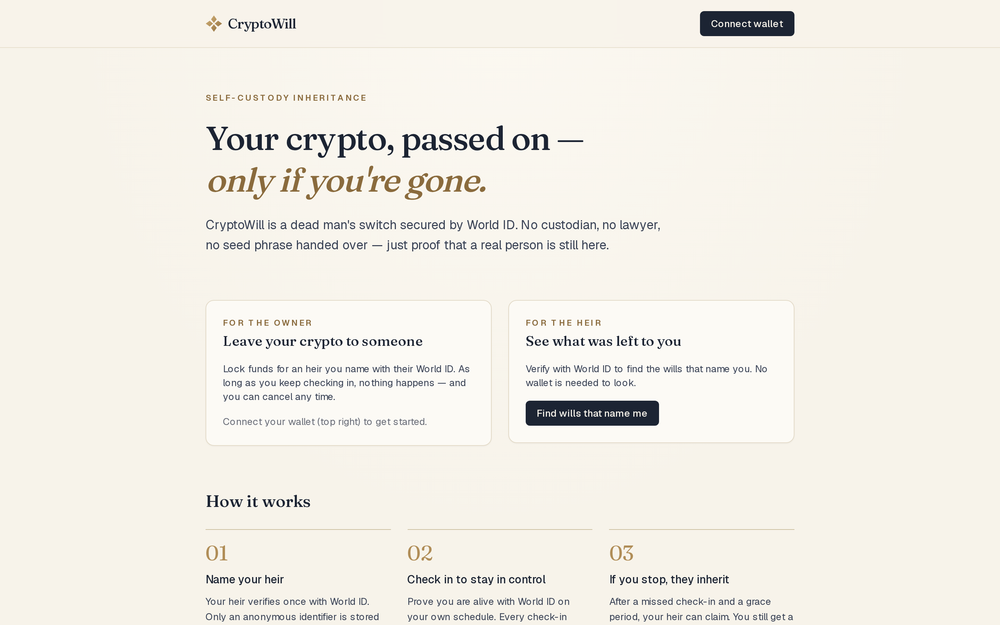
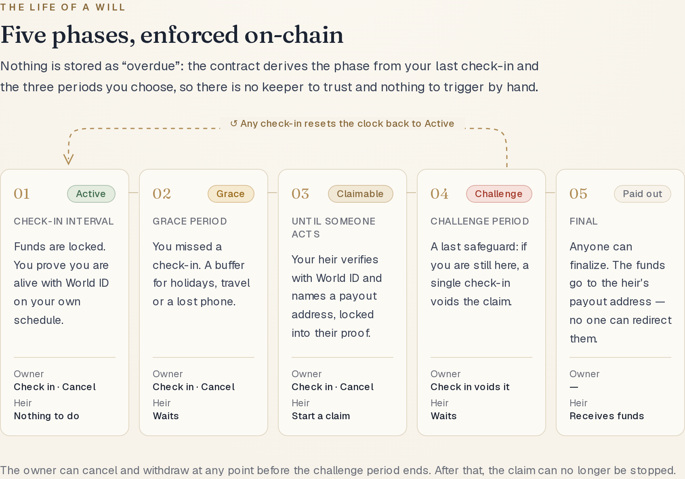
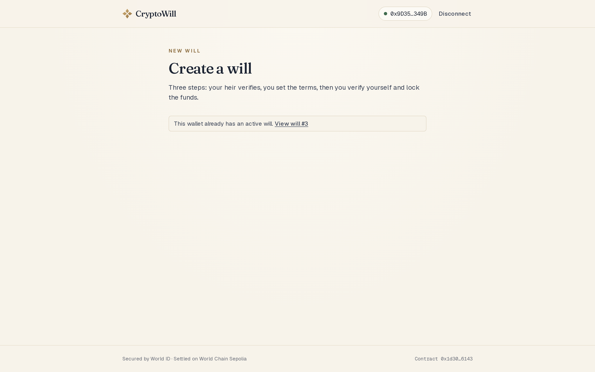
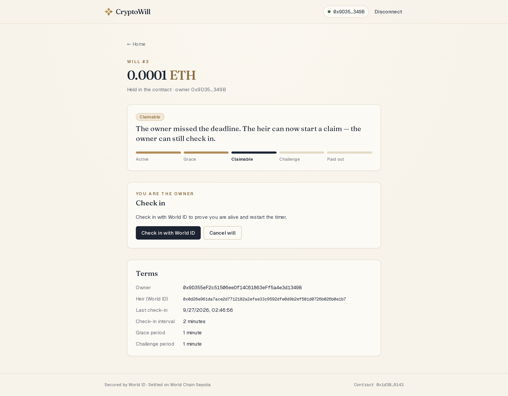
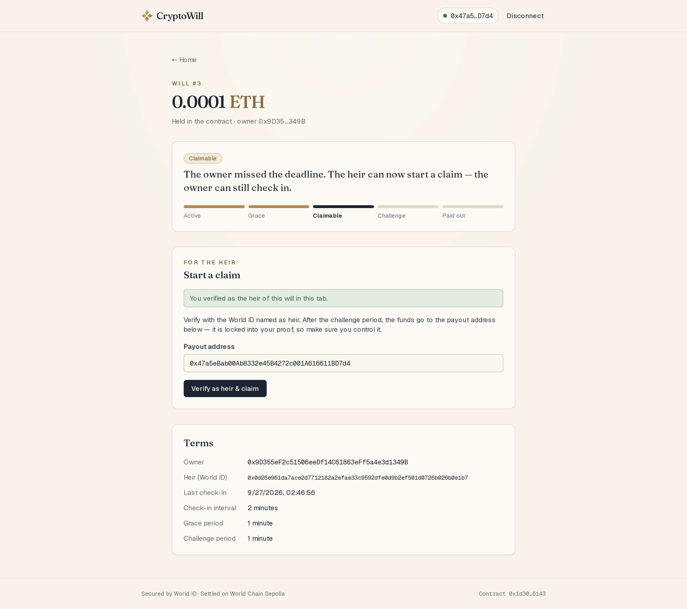
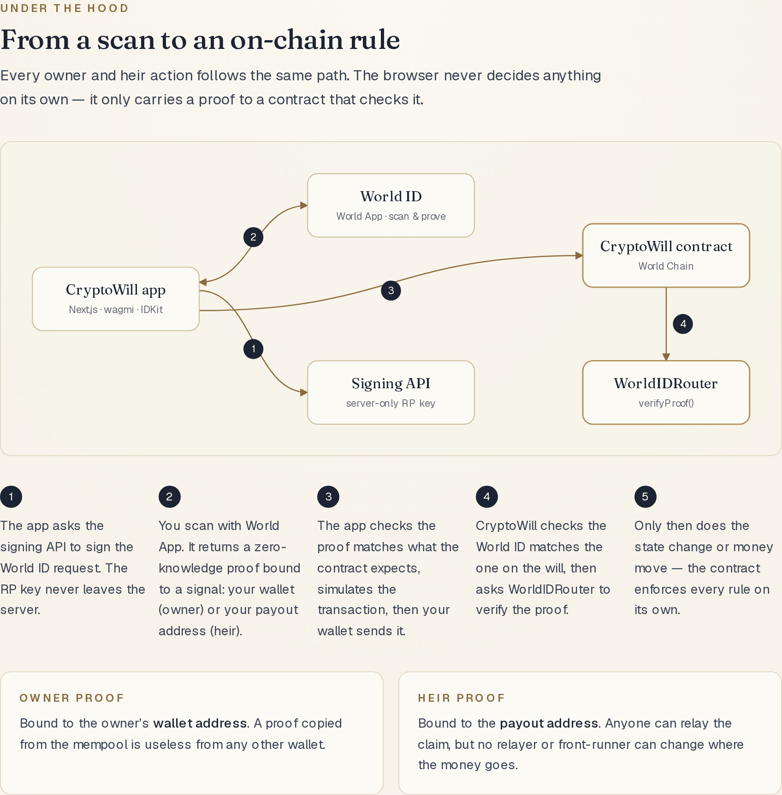
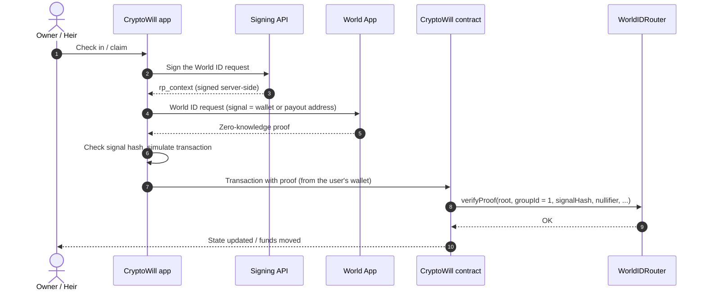

<p align="center">
  
</p>

<h1 align="center">CryptoWill</h1>

<p align="center">
  <strong>Your crypto, passed on — only if you're gone.</strong><br />
  A dead man's switch for self-custody inheritance, secured by World ID.
</p>

<p align="center">
  <a href="https://cryptowill-web.vercel.app/"><strong>Live demo</strong></a> ·
  <a href="https://github.com/party1168/cryptowill">Smart contract</a> ·
  <a href="https://sepolia.worldscan.org/address/0x1d3000d8fd4b8061e0766179f93f51de47d26143">Contract on Worldscan</a>
</p>



## What it is

CryptoWill lets you leave crypto to someone without handing over a seed phrase, trusting a custodian, or hiring a lawyer.

1. **Name your heir.** Your heir verifies once with World ID. Only an anonymous identifier is stored on-chain — no name, no wallet address.
2. **Check in to stay in control.** You prove you are a living, unique human with World ID on your own schedule. Every check-in restarts the timer.
3. **If you stop, they inherit.** After a missed check-in and a grace period, your heir can claim. You still get a challenge window to stop it by checking in once more.

This repository is the web app. The rules themselves live in the [CryptoWill smart contract](https://github.com/party1168/cryptowill); this app only collects World ID proofs and carries them to the contract.

## The life of a will



| Phase | Owner can | Heir can |
| --- | --- | --- |
| **Active** | Check in, cancel | — |
| **Grace** | Check in, cancel | — |
| **Claimable** | Check in, cancel | Start a claim with a payout address |
| **Challenge** | Check in to void the claim, cancel | — |
| **Paid out** | — | Receives the funds (anyone can finalize) |

The phase is derived on-chain from the last check-in and the three periods chosen at creation, so there is no keeper and nothing to trigger by hand.

## Screenshots

| Create a will | Owner view |
| --- | --- |
|  |  |

| Heir view | Under the hood |
| --- | --- |
|  |  |

## How it works



- **Two World ID actions.** `cryptowill-alive-check` is used by the owner (create, check in, cancel); `cryptowill-heir-claim` is used by the heir (register, look up wills, claim).
- **Proofs are bound to addresses.** The owner's proof signal is the owner's wallet address; the heir's claim signal is the payout address. A proof copied from the mempool can't be used from another wallet or redirected to another address.
- **The heir has no wallet on-chain.** Heirs find the wills that name them by verifying with World ID; the contract keeps an index from heir identifier to will IDs. Any wallet can relay the heir's claim.
- **Verification happens on-chain.** The app checks each proof before sending, so users never sign a transaction that would revert — but the contract and the WorldIDRouter are the only things that decide.

## Why Proof of Human

CryptoWill has two moments that need trust:

1. **Checking in** — is this still the person who wrote the will?
2. **Claiming** — is this the heir who was named?

Both need a stable, anonymous identity that only one real human can reproduce, verified on-chain because it releases funds irreversibly. **Orb-verified Proof of Human** is the minimum credential that provides exactly that:

- **Passport / NFC** would reveal attributes such as nationality or age that a will never needs.
- **Selfie Check** gives lower assurance for a transfer that can't be undone.
- **Orb Proof of Human** proves "a unique human, the same one as before" — and nothing else.

We verify legacy (World ID 3.0) Orb proofs on-chain on purpose: our design treats the nullifier as a persistent identity, so the owner produces the same identifier on every check-in. World ID 4.0 uniqueness nullifiers are one-time, which would make repeated check-ins impossible.

## World ID integration debrief

- **Time to first success:** about 4 hours to the first proof verified on-chain through the WorldIDRouter; about 12 hours to the complete product.
- **Friction:** new Developer Portal apps are forced onto World ID 4.0, while our use case needs repeated verification of the same person, so finding the `allow_legacy_proofs` + `orbLegacy()` path took most of the first 4 hours. IDKit 4 also requires a backend to sign `rp_context`, even though all verification happens on-chain. The simulator only recognizes staging apps, and its "app not found" error didn't point to the environment mismatch. One simulator identity returned a root that had expired months earlier, which only surfaced on-chain as `ExpiredRoot()`.
- **Missing capability / docs:** an on-chain path for "same human, many times" under 4.0; documentation that `0x` hex signals are hashed as raw bytes (matching `abi.encodePacked(address)`); a list of router errors and their selectors.
- **Most impactful improvement:** an official on-chain verification path for repeated verification of the same person in World ID 4.0 — liveness checks, recurring eligibility and account recovery all depend on it.

## Tech stack

- [Next.js 16](https://nextjs.org) (App Router) and React 19
- [wagmi 3](https://wagmi.sh) and [viem 2](https://viem.sh) for wallet and contract calls
- [IDKit 4](https://docs.world.org/world-id) for World ID, with legacy v3 proofs for on-chain verification
- Tailwind CSS 4
- World Chain Sepolia

## Getting started

Prerequisites: Node.js 20+, [pnpm](https://pnpm.io), a browser wallet (e.g. MetaMask), and a World ID app with an RP signing key from the [World Developer Portal](https://developer.world.org).

```bash
pnpm install
cp .env.example .env.local   # then fill in WORLD_ID_RP_ID and WORLD_ID_SIGNING_KEY
pnpm dev
```

Open [http://localhost:3000](http://localhost:3000). With the `staging` environment, scan the QR codes with the [World ID Simulator](https://simulator.worldcoin.org).

### Environment variables

| Variable | Where | Description |
| --- | --- | --- |
| `NEXT_PUBLIC_WORLD_ID_APP_ID` | client | World ID app ID |
| `NEXT_PUBLIC_WORLD_ID_ENVIRONMENT` | client | `staging` (simulator) or `production` |
| `NEXT_PUBLIC_CRYPTOWILL_ADDRESS` | client | Deployed CryptoWill contract |
| `NEXT_PUBLIC_CRYPTOWILL_DEPLOY_BLOCK` | client | Block the contract was deployed in |
| `NEXT_PUBLIC_RPC_URL` | client | World Chain Sepolia RPC |
| `WORLD_ID_RP_ID` | server | Relying-party ID from the Developer Portal |
| `WORLD_ID_SIGNING_KEY` | server | **Secret.** RP signing key, used only by `/api/rp-signature` |

The signing API only signs the two CryptoWill actions and rejects everything else.

### Contract ABI

`lib/abi.ts` is generated from the contracts repository's Foundry build output. After changing the contract:

```bash
# in ../cryptowill
forge build
# in this repo (set CRYPTOWILL_CONTRACTS_DIR if the contracts repo lives elsewhere)
pnpm sync-abi
```

The contract is not upgradeable, so a redeploy means a new address: update `NEXT_PUBLIC_CRYPTOWILL_ADDRESS` and `NEXT_PUBLIC_CRYPTOWILL_DEPLOY_BLOCK`.

## Project structure

```
app/
  page.tsx               Home: owner and heir entry points, how it works
  create/page.tsx        Create a will (register heir -> set terms -> verify & create)
  will/[id]/page.tsx     A will: phase, timeline, owner / heir / finalize actions
  api/rp-signature/      Server-side World ID request signing
  dev/                   Integration console (development only, 404 in production)
components/              UI (design primitives in ui.tsx, home page sections in home/)
hooks/
  useWorldIdProof.tsx    Promise-style World ID request -> decoded, validated proof
  useWillTx.ts           simulate -> sign -> wait for receipt
  useWill.ts             Read a will and its on-chain phase
  useHeirWills.ts        Find the wills naming a World ID
lib/
  worldid.ts             Proof decoding and signal-hash checks
  errors.ts              Contract and WorldIDRouter errors -> readable messages
  config.ts              Environment configuration
scripts/sync-abi.mjs     ABI generation from the contracts repo
```

## Deployment

The app runs on Vercel at **[cryptowill-web.vercel.app](https://cryptowill-web.vercel.app/)**. Set the environment variables above in the Vercel project settings, keeping `WORLD_ID_SIGNING_KEY` server-only.
